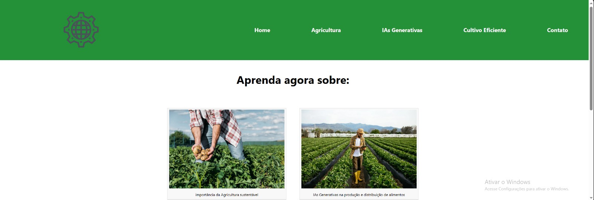

# PROJETO GLOBAL SOLUTION
.png)
Descrição do projeto, tecnologias utilizadas, como funcionar

## Índice
- <a href="#funcionalidades">Funcionalidades do Projeto</a>
- <a href="#Layout">Layout</a>
- <a href="#demonstracao">Demonstração</a>
- <a href="#rodar">Como rodar este projeto?</a>
- <a href="#Tecnologias">Tecnologias Utilizadas</a>
- <a href="#autoras">Pessoas Autoras</a>
- <a href="passos">Próximos Passos</a>

## Funcionalidades do Projeto

 - [x] Cadastro de Instituições Beneficentes.
 - [x] Mapeamento dos locais vulneráveis do Brasil.
 - [x] Gerar o orçamento que seria necessário para resolução do problema.
 - [x] Notificar as ONGs mais próximas dos locais de vulnerabilidade.

 ## Layout
 

## Como rodar esse projeto?

```

```

## Tecnologias Utilizadas
1. Falta colocar

## Pessoas Autoras

 - 
 Geovana Ribeiro D. Silva (RM 99646) 
 - 
 Gustavo Bernardo Basilio (RM 93770)
 - 
 Henrique Sanches Lima (RM 551633)
 - 
 Leonardo Ferreira Lizier (RM 551509)

## Próximos Passos
 - [ ] Pensamentos futuros
 - [ ] testes
 - [ ] exemplos
