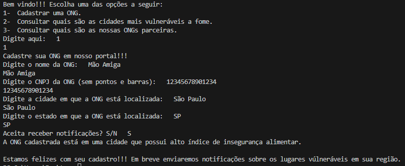
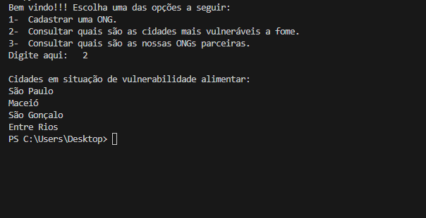
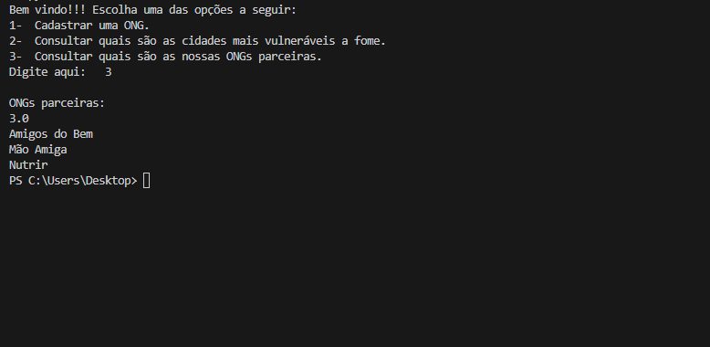

# PROJETO CHALLENGE 2023
.png)
Utilização da Inteligência Artificial com o intuito de mapear os índices de insegurança alimentar da população.

## Índice
- <a href="#funcionalidades">Funcionalidades do Projeto</a>
- <a href="#Layout">Layout</a>
- <a href="#demonstracao">Demonstração</a>
- <a href="#rodar">Como rodar este projeto?</a>
- <a href="#Tecnologias">Tecnologias Utilizadas</a>
- <a href="#autoras">Pessoas Autoras</a>
- <a href="passos">Próximos Passos</a>

## Funcionalidades do Projeto

 - [x] Cadastro de Instituições Beneficentes.
 - [x] Mapeamento dos locais vulneráveis do Brasil.
 - [x] Consulta da lista de locais mais vulneráveis à fome.
 - [x] Consulta de ONGs parceiras.
 - [x] Notificação para as ONGs mais próximas dos locais de vulnerabilidade.

 ## Layout
 

 ## Requisitos
 - [x] Banco de dados.
 - [x] Criação da página web.
 - [x] Identidade visual.
 - [x] Para que uma ONG  seja cadastrada no sistema, é necessário um CNPJ válido.

## Demonstração
 
 
 

## Detalhes do Projeto
- [x] A plataforma que notifica ONGs sobre locais de vulnerabilidade alimentar pode desempenhar um papel crucial na redução da insegurança alimentar. Aqui estão algumas maneiras pelas quais essa plataforma pode ajudar nesse contexto:

1. Identificação de áreas de vulnerabilidade: A plataforma pode coletar e analisar dados de diversas fontes para identificar áreas onde a insegurança alimentar é mais prevalente. Ao mapear essas áreas, as ONGs podem direcionar seus esforços para as regiões mais afetadas.

2. Notificação de ONGs: A plataforma pode enviar notificações em tempo real para as ONGs sempre que uma nova área de vulnerabilidade alimentar for identificada. Isso permite que as organizações ajam rapidamente, mobilizando recursos e respondendo às necessidades locais de forma eficiente.

3. Cooperação e compartilhamento de informações: A plataforma pode facilitar a colaboração entre diferentes ONGs, governos locais, empresas e outras partes interessadas. Ao compartilhar informações sobre locais de vulnerabilidade alimentar, recursos disponíveis e melhores práticas, a plataforma ajuda a otimizar os esforços coletivos para combater a insegurança alimentar.

4. Sensibilização e mobilização da comunidade: Além de notificar as ONGs, a plataforma também pode ser usada para conscientizar a comunidade em geral sobre a insegurança alimentar e as ações que estão sendo realizadas para combatê-la. Isso pode ajudar a mobilizar recursos adicionais, voluntários e doações para apoiar os esforços de combate à fome.

5. Planejamento estratégico: Com base nos dados coletados pela plataforma, as ONGs podem fazer um planejamento estratégico mais eficiente para suas intervenções. Isso inclui o dimensionamento adequado de recursos, a alocação de alimentos e a implementação de programas sustentáveis ​​de segurança alimentar.

Em suma, uma plataforma que notifica as ONGs sobre locais de vulnerabilidade alimentar pode desempenhar um papel fundamental na redução da insegurança alimentar, permitindo uma resposta mais rápida, uma melhor coordenação de esforços e um planejamento estratégico mais eficiente.

## Pessoas Autoras

 - 
 Geovana Ribeiro D. Silva (RM 99646) 
 - 
 Gustavo Bernardo Basilio (RM 93770)
 - 
 Henrique Sanches Lima (RM 551633)
 - 
 Leonardo Ferreira Lizier (RM 551509)

## Próximos Passos
 - [ ] Aperfeiçoamento do sistema.
 - [ ] Maior alcance.
 - [ ] Maior capacidade de armazenamento de dados.
 - [ ] Melhorar usabilidade.
 - [ ] Monitorar e avaliar intervenções, identificando eficácia e áreas que precisam de suporte adicional.